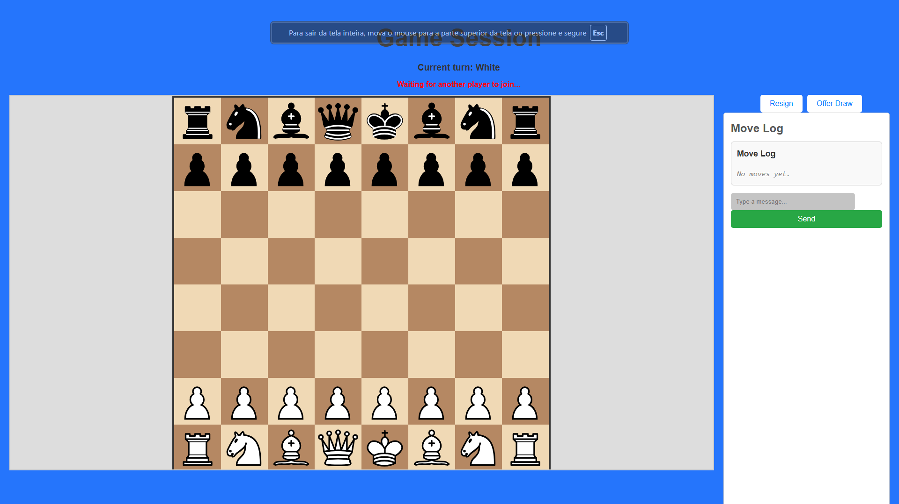

# GopherMate chess app
A project for testing AI generated code with Copilot

## Game view

## Lobby

The goal of this project is already achieved. The AI coding assistant did a great job and implemented most of the features for a working chess app.
Some extra features not implemented are
- Improve knight move validation to not allow king to suicide
- Use realtime oponent move notification to frontend
- Use configurable host instead of localhost
- if the user refreshes the page the game breaks
- quick match button (enters in any open room)
As well as some other improvements that were not planned.
